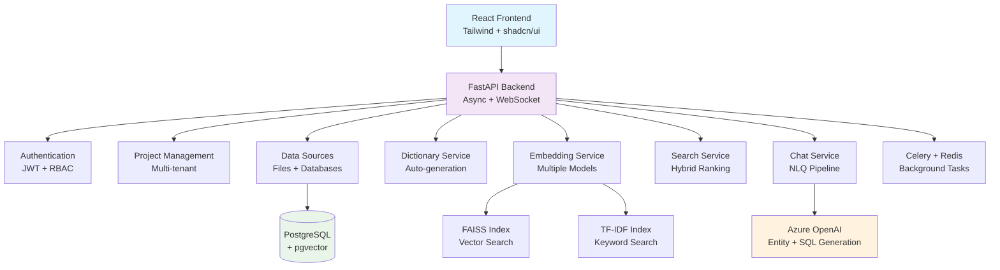

# StructuraAI - Enterprise RAG Platform

<div align="center">


[](https://www.python.org/downloads/)
[](https://reactjs.org/)
[](https://fastapi.tiangolo.com/)
[](https://opensource.org/licenses/MIT)

**A comprehensive enterprise-grade RAG platform for structured data querying with natural language processing**

[Features](#-features) • [Quick Start](#-quick-start) • [Documentation](#-documentation) • [API Reference](#-api-reference)

</div>

---

## 🎯 Overview

StructuraAI is a sophisticated **Retrieval-Augmented Generation (RAG) platform** designed specifically for **structured data querying**. It combines the power of large language models with intelligent data understanding to enable natural language interactions with your databases, spreadsheets, and business data.

### 🔥 Key Highlights

- **🧠 Intelligent Entity Extraction** - Automatically identifies tables, columns, and business terms from natural language
- **🔍 Hybrid Search** - Combines semantic search, keyword matching, and fuzzy logic for optimal results
- **🗣️ Natural Language Queries** - Ask questions in plain English and get SQL + results
- **📚 Smart Data Dictionary** - Auto-generates and manages business glossaries
- **⚡ Multiple Index Types** - FAISS, pgvector, TF-IDF, and BM25 support
- **🎨 Stunning UI** - Modern glassmorphism design with enterprise-grade UX
- **🔧 Full Automation** - Jupyter notebook integration for programmatic access

---

## ✨ Features

### 🏗️ **Tab 0: Projects**
- **Project Management** - CRUD operations with full metadata
- **Resource Organization** - All assets tied to project hierarchy
- **Clone & Archive** - Easy project duplication and lifecycle management

### 📊 **Tab 1: Data Sources**  
- **File Upload** - Excel, CSV, JSON with auto-table creation
- **Database Connections** - PostgreSQL, MySQL, SQLite, MSSQL, Oracle
- **Schema Introspection** - Automatic metadata extraction and profiling
- **Connection Testing** - Validate and monitor data source health

### 📖 **Tab 2: Data Dictionary**
- **Smart Glossary** - Auto-generate terms from table/column analysis
- **Business Context** - Synonyms, abbreviations, domain tags
- **Approval Workflow** - Review and approval process for definitions
- **Version Control** - Track changes and maintain definition history

### 🧬 **Tab 3: Embeddings & Indexing**
- **Multiple Models** - sentence-transformers, OpenAI, Azure OpenAI, BERT
- **Flexible Indexing** - FAISS, pgvector, TF-IDF, BM25 options
- **Granular Control** - Table, column, or dictionary-level embeddings
- **Performance Monitoring** - Build progress and index statistics

### 🔍 **Tab 4: Search Playground**
- **Multi-Modal Search** - Semantic, keyword, hybrid approaches
- **Real-Time Testing** - Interactive query exploration
- **Similarity Scoring** - Ranked results with confidence metrics
- **Export Capabilities** - Save search configurations and results

### 💬 **Tab 5: Natural Language Chat**
- **Complete Pipeline** - Entity extraction → Mapping → SQL → Results
- **Interactive Validation** - User confirmation at each step
- **Feedback Loop** - Learn from corrections and improve accuracy
- **SQL Generation** - Context-aware query construction
- **Result Interpretation** - Natural language summaries of data

### ⚙️ **Tab 6: Admin Panel**
- **Database Browser** - Paginated table exploration
- **SQL Executor** - Safe query execution with syntax highlighting
- **System Monitoring** - Health metrics and performance stats
- **User Management** - RBAC and permission controls
- **Backup & Restore** - Data protection and recovery tools

---

## 🚀 Quick Start

### Prerequisites

- **Python 3.9+** (3.11 recommended)
- **Node.js 18+** and npm/yarn
- **Azure OpenAI** account with API access
- **Git** for version control

### 1. Clone the Repository

```bash
git clone https://github.com/your-org/structura-ai.git
cd structura-ai
```

### 2. Backend Setup

```bash
# Create virtual environment
python -m venv venv

# Activate virtual environment
# Windows:
venv\Scripts\activate
# macOS/Linux:
source venv/bin/activate

# Install dependencies
pip install -r requirements.txt

# Setup environment variables
cp .env.example .env
# Edit .env with your Azure OpenAI credentials
```

### 3. Frontend Setup

```bash
cd frontend
npm install
npm run dev
```

### 4. Configure Environment

Edit `.env` file with your credentials:

```bash
# Required: Azure OpenAI Configuration
AZURE_OPENAI_ENDPOINT=https://your-resource.openai.azure.com/
AZURE_OPENAI_API_KEY=your-api-key-here
AZURE_OPENAI_DEPLOYMENT=gpt-4

# Optional: Database (SQLite used by default)
DATABASE_URL=sqlite:///structura_ai.db
```

### 5. Run the Application

```bash
# Start the backend server
python run.py

# In another terminal, start the frontend (if not already running)
cd frontend
npm run dev
```

### 6. Access the Application

- **Frontend**: http://localhost:3000
- **API Docs**: http://localhost:8000/api/docs
- **Admin Panel**: http://localhost:3000/admin

---

## 🏗️ Architecture



---

## 📋 Project Structure

```
structura_ai/
├── 📁 backend/                 # FastAPI backend
│   ├── 📁 api/                # API routes and endpoints
│   ├── 📁 models/             # SQLAlchemy database models
│   ├── 📁 schemas/            # Pydantic request/response schemas
│   ├── 📁 services/           # Business logic services
│   └── 📁 utils/              # Utility functions and helpers
├── 📁 frontend/               # React frontend
│   ├── 📁 src/
│   │   ├── 📁 components/     # Reusable UI components
│   │   ├── 📁 features/       # Feature-specific components
│   │   ├── 📁 hooks/          # Custom React hooks
│   │   ├── 📁 services/       # API communication
│   │   └── 📁 utils/          # Frontend utilities
├── 📁 notebooks/              # Jupyter automation examples
├── 📁 uploads/                # File upload storage
├── 📁 indexes/                # Search index storage
├── 📄 run.py                  # Application entry point
├── 📄 config.py              # Configuration management
└── 📄 requirements.txt       # Python dependencies
```

---

## 🔧 Configuration

### Environment Variables

| Variable | Description | Required | Default |
|----------|-------------|----------|---------|
| `AZURE_OPENAI_ENDPOINT` | Azure OpenAI service endpoint | ✅ | - |
| `AZURE_OPENAI_API_KEY` | Azure OpenAI API key | ✅ | - |
| `AZURE_OPENAI_DEPLOYMENT` | Model deployment name | ✅ | gpt-4 |
| `DATABASE_URL` | Database connection string | ❌ | SQLite |
| `EMBEDDING_MODEL` | Default embedding model | ❌ | all-MiniLM-L6-v2 |
| `MAX_QUERY_LENGTH` | Maximum query length | ❌ | 1000 |
| `SQL_MAX_ROWS` | Maximum SQL result rows | ❌ | 10000 |

### Model Support

**LLM Providers:**
- ✅ Azure OpenAI (Primary)
- ✅ OpenAI API
- ✅ Anthropic Claude

**Embedding Models:**
- ✅ sentence-transformers
- ✅ OpenAI text-embedding-3
- ✅ Azure OpenAI embeddings
- ✅ Hugging Face models

**Search Indexes:**
- ✅ FAISS (CPU/GPU)
- ✅ pgvector (PostgreSQL)
- ✅ TF-IDF (sklearn)
- ✅ BM25 (text search)

---

## 📚 Documentation

### API Reference

Complete API documentation is available at `/api/docs` when running the server.

**Core Endpoints:**

```bash
# Project Management
GET    /api/projects              # List projects
POST   /api/projects              # Create project
GET    /api/projects/{id}         # Get project details
PUT    /api/projects/{id}         # Update project
DELETE /api/projects/{id}         # Delete project

# Data Sources
POST   /api/sources/upload        # Upload file
POST   /api/sources/database      # Connect database
GET    /api/sources/{id}/schema   # Get schema info
GET    /api/sources/{id}/preview  # Preview data

# Natural Language Chat
POST   /api/chat/query            # Complete NLQ pipeline
POST   /api/chat/extract-entities # Entity extraction only
POST   /api/chat/generate-sql     # SQL generation only
POST   /api/chat/execute-sql      # Execute SQL query
```

### Automation via Jupyter

```python
# Example: Automated project setup
import requests

# Create project
project = requests.post('http://localhost:8000/api/projects', json={
    'name': 'My Analytics Project',
    'description': 'Customer analytics automation'
})

# Upload data
with open('customer_data.csv', 'rb') as f:
    requests.post(f'http://localhost:8000/api/sources/upload?project_id={project.id}', 
                  files={'file': f})

# Query data
response = requests.post('http://localhost:8000/api/chat/query', json={
    'project_id': project.id,
    'query': 'What are the top 10 customers by revenue?',
    'auto_execute': True
})
```

---

## 🛠️ Development

### Running Tests

```bash
# Backend tests
pytest tests/ -v

# Frontend tests  
cd frontend
npm test
```

### Code Quality

```bash
# Python formatting
black backend/ --line-length 88
isort backend/

# Type checking
mypy backend/

# Linting
flake8 backend/
```

### Database Migrations

```bash
# Create migration
alembic revision --autogenerate -m "Add new table"

# Apply migrations
alembic upgrade head
```

---

## 🔐 Security

- **SQL Injection Protection** - Parameterized queries and statement validation
- **Access Control** - Row-level security and RBAC
- **API Security** - Rate limiting and input validation  
- **Data Privacy** - PII detection and masking capabilities
- **Audit Logging** - Complete audit trail for all operations

---

## 🤝 Contributing

We welcome contributions! Please see our [Contributing Guide](CONTRIBUTING.md) for details.

### Development Workflow

1. Fork the repository
2. Create a feature branch (`git checkout -b feature/amazing-feature`)
3. Commit your changes (`git commit -m 'Add amazing feature'`)
4. Push to the branch (`git push origin feature/amazing-feature`)
5. Open a Pull Request

---

## 📄 License

This project is licensed under the MIT License - see the [LICENSE](LICENSE) file for details.

---

## 🆘 Support

- **📖 Documentation**: [docs.structura-ai.com](https://docs.structura-ai.com)
- **💬 Discord**: [Join our community](https://discord.gg/structura-ai)
- **🐛 Issues**: [GitHub Issues](https://github.com/your-org/structura-ai/issues)
- **📧 Email**: support@structura-ai.com

---

## 🌟 Acknowledgments

- **FastAPI** - Modern, fast web framework for building APIs
- **React** - User interface library
- **Tailwind CSS** - Utility-first CSS framework
- **OpenAI/Azure** - Large language model capabilities
- **FAISS** - Efficient similarity search and clustering
- **PostgreSQL** - Advanced open source database

---

<div align="center">

**⭐ Star this repo if you find it helpful!**

Made with ❤️ by the StructuraAI team

</div>